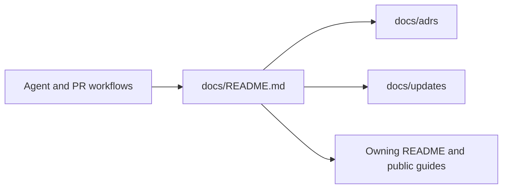

# Identity documentation and frontend chat setup

PR: https://github.com/trytilde/docs/pull/34

## Intent of the change

Document independent application authentication, org-owned identities, proxy token setup, managed linking, and a same-origin frontend chat UI.

## Architecture changes

Governing decision: [0001-repository-documentation-convention](../adrs/0001-repository-documentation-convention.md).
This repository documents the identity/authentication contracts implemented by Tilde API and the SDK. Its own runtime architecture is unchanged.

## Summarized changes

- Documented native first-org/team setup and invitation-directed signup, with account-only Clerk lifecycle webhooks.
- Updated identity and membership examples to cursor pagination.
- Reconciled upstream CLI naming and agent-key terminology while retaining the new delegation guidance.
- Added a dedicated Identities navigation section for overview/provisioning, proxy tokens, and managed account linking.
- Documented reviewed identity membership/identifier management, strict suspension recovery, safe proxy transport, and the signed original-event reset cutoff.
- Added frontend chat setup covering trusted sessions, private session creation, streaming, uploads, and realtime tickets.
- Linked the guide from Quickstart and ChatKit and refreshed package names.
- Added shared repository documentation/PR conventions; internal records are excluded from Mintlify publication.
- Validation: Mintlify build validation, broken-link checks, and accessibility checks passed again after reconciling current upstream documentation.
- Independent review checked identity/proxy/linking examples against the owning SDK/API source and scanned the added diff for credential-shaped values; no exposure was found.

## Critical to apply

yes

Publish alongside the matching Tilde API/SDK/HeyAsh release. Examples require the SDK proxy/identity exports and configured application credentials; they must not be presented as supported by an older deployed API.

Coordinated implementation: [API 275](https://github.com/trytilde/api/pull/275),
[SDK 153](https://github.com/trytilde/dispatch/pull/153),
[HeyAsh 6](https://github.com/trytilde/heyash/pull/6), and
[Clerk configuration 88](https://github.com/trytilde/infrastructure-terraform/pull/88).
Merging documentation does not establish that the matching application release
or reset has been deployed.
