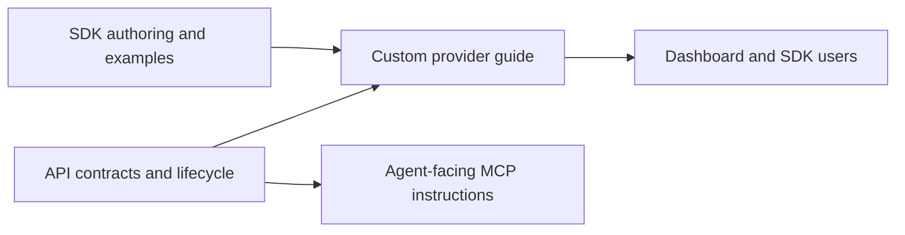

# Custom ChatKit provider documentation

PR: https://github.com/trytilde/docs/pull/36 (draft)

## Intent of the change

Explain how customers register, host, configure, and operate TypeScript ChatKit
providers, including session tools, private delivery, and streaming clients.

## Architecture changes

ADR review: no new decision. This documentation records the approved companion
API and SDK contracts; it introduces no independent runtime architecture change.
The existing repository documentation convention remains applicable. Runtime
boundaries are recorded in the companion API ADR-0023 and SDK ADR-0001.

## Summarized changes

- Add the custom provider guide and navigation entry; link it from ChatKit.
- Explain discovery/setup, OAuth resume, scoped ingestion, session tools, rich
  email/BCC semantics, delivery recovery, streaming authorization, and imports.
- Add exact Global MCP management actions and secret-handling instructions to
  the hidden ChatKit agent guide.
- Mintlify build validation, broken-link checks, and accessibility checks passed
  during implementation. Build/link checks and diff/record-structure checks
  were rerun successfully during PR preparation.
- GitHub currently reports this draft mergeable. Review the companion API
  conflicts and release gates before publishing. No documentation deployment or live
  API-backed tool catalog regeneration was performed.
- Related API PR: https://github.com/trytilde/api/pull/276. Related SDK PR: unavailable because `trytilde/harness-sdk` is archived and GitHub rejected the push.

## Critical to apply

yes

Publish this guide with the compatible API and SDK releases. Deploy the additive
API and upgrade workers before enabling custom providers, then release the SDK.
Regenerate API-backed tool catalog pages from that deployment; do not advertise
these endpoints as available on older deployments. Keep the hidden agent guide
out of sidebar navigation.
