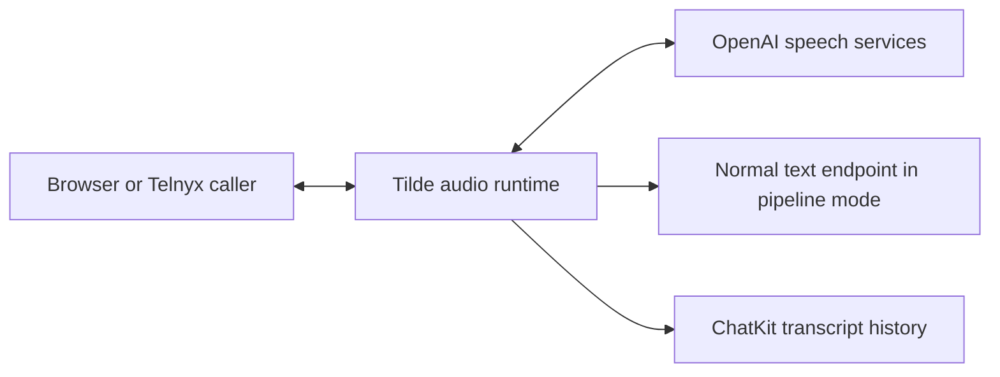

# PR 37: Realtime voice documentation

https://github.com/trytilde/docs/pull/37

## Intent of the change

Explain agent-owned speech configuration, the existing per-turn endpoint callback,
and the manual browser/Telnyx voice workflow for the matching API and SDK release.

## Architecture changes

ADR review: no new decision in this repository. This guide documents the API's
ADR 0023: speech orchestration belongs to Tilde and calls use normal ChatKit sessions.

## Summarized changes

- Human guide: agent voice settings, pipeline/native modes, callback context,
  browser admission, Telnyx setup, and explicit transport/tool limitations.
- Agent guide: exact REST paths, configuration fields, media format, managed
  credential sources, and portable versus installation-specific configuration.
- Validation: Mintlify build, broken links, and accessibility checks pass.
- Live OpenAI inference was tested in the API worktree. A live Telnyx call and
  browser microphone interaction remain manual checks; no deployment is claimed.

## Critical to apply

yes

Publish after the matching API deployment and SDK release. Operators need public
HTTPS/WSS, an OpenAI server key or managed credential, and a dedicated Telnyx
application/number binding. Native endpoint tools, browser personal-tool federation,
direct WebRTC/SIP, ElevenLabs, voice notes, and retained audio are outside this slice.

Related API: https://github.com/trytilde/api/pull/277.
Related SDK: https://github.com/trytilde/dispatch/pull/155.
The API needs current-main conflict resolution; the SDK needs a complete contract
refresh from that integrated API head before release.
