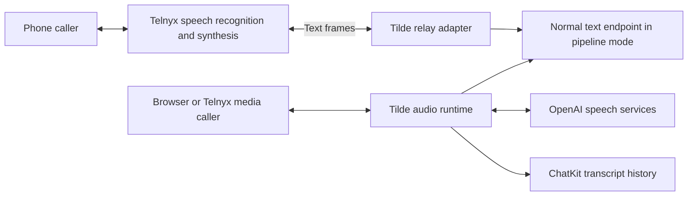

# PR 37: Realtime voice documentation

https://github.com/trytilde/docs/pull/37

## Intent of the change

Explain agent-owned speech configuration, the existing per-turn endpoint callback,
and the manual browser/Telnyx media and Conversation Relay workflows for the matching API and SDK release.

## Architecture changes

ADR review: no new decision in this repository. This guide documents the API's
ADR 0025: speech orchestration belongs to Tilde and calls use normal ChatKit sessions.

## Summarized changes

- Human guide: agent voice settings, OpenAI pipeline/native and Telnyx relay modes, callback context,
  browser admission, Telnyx setup, and explicit transport/tool limitations.
- Agent guide: exact REST paths, configuration fields, media format, managed
  credential sources, and portable versus installation-specific configuration.
- Relay revision adds a real Telnyx Voice channel, self-managed or managed
  webhook setup on an existing customer application, phone-only language/interruption settings, and
  separate generated-text versus carrier-reported spoken-prefix semantics.
- Validation: relay-revision `mint validate`, `mint broken-links`, and `mint a11y`
  pass. No live Conversation Relay or carrier call was performed.
- Live OpenAI inference was tested in the API worktree. A live Telnyx call and
  browser microphone interaction remain manual checks; no deployment is claimed.

## Critical to apply

yes

Publish after the matching API deployment and SDK release. Operators need public
HTTPS/WSS, an OpenAI server key or managed credential for OpenAI modes, and a dedicated Telnyx
application/number binding. Relay uses the carrier speech service and the
endpoint's own text model; it needs no OpenAI speech key. Native endpoint tools, browser personal-tool federation,
direct WebRTC/SIP, ElevenLabs, voice notes, and retained audio are outside this slice.

Related API: https://github.com/trytilde/api/pull/277.
Related SDK: https://github.com/trytilde/dispatch/pull/155.
API main is integrated and Rust validation is ongoing. SDK generation must retain
the optional wallet surface already exposed by its generated client before release.
