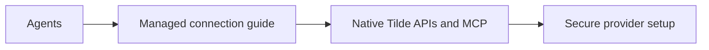

# Document direct resource workflows

PR: https://github.com/trytilde/docs/pull/38

## Intent of the change

Replace obsolete proposal instructions with native permission-controlled operations
and the managed connection process used by Dispatch and Heyash.

## Architecture changes

ADR review: no new decision in this documentation repository. The owning API and
Dispatch ADRs define proposal retirement, scoped history and setup projections.

## Summarized changes

- Document discovery, account reuse, user/bot ownership, broker completion and
  verification; external channels use returned secure setup links.
- Explain proposal API retirement and document
  session-scoped history search.
- Regenerate the existing provider pages and snippet to satisfy the repository's
  generated-content check. Generation check and Mintlify link validation pass.

## Critical to apply

yes

Publish these instructions alongside the matching API and client changes.
Existing proposal callers must migrate before the retirement migrations run.
This PR does not publish packages or manually deploy applications.
