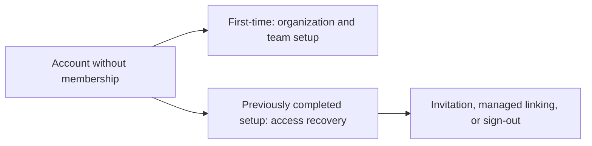

# Distinguish initial organization setup from account recovery

PR: Pending

## Intent of the change

Correct the identities guide so accounts that already completed organization
onboarding are not told to create another first organization after losing their
remaining memberships.

## Architecture changes

ADR review: no new decision. This clarification documents the existing account
recovery and replay-protection behavior in [API PR 275](https://github.com/trytilde/api/pull/275)
and its governing [API ADR 23](https://github.com/trytilde/api/blob/codex/org-runtime-identities/docs/adrs/0023-org-runtime-identities-and-proxy-delegation.md).
This documentation repository's runtime architecture is unchanged.

## Summarized changes

- Restricted first-organization wizard guidance to first-time accounts.
- Documented the Restore organization access screen for accounts whose organization onboarding was already completed.
- Preserved invitation-directed signup and managed linking, and clarified that retries do not recreate deleted organizations or restore revoked access.
- Compared the wording with the API account-onboarding component and ADR; API and HeyAsh files were not changed.
- Validation: `mint validate`, `mint broken-links`, `mint a11y`, and `git diff --check` passed.

## Critical to apply

no

This documentation clarification introduces no migration or configuration change.
The behavior belongs to the coordinated API identity release; merging the guide
does not claim that release has been deployed.
